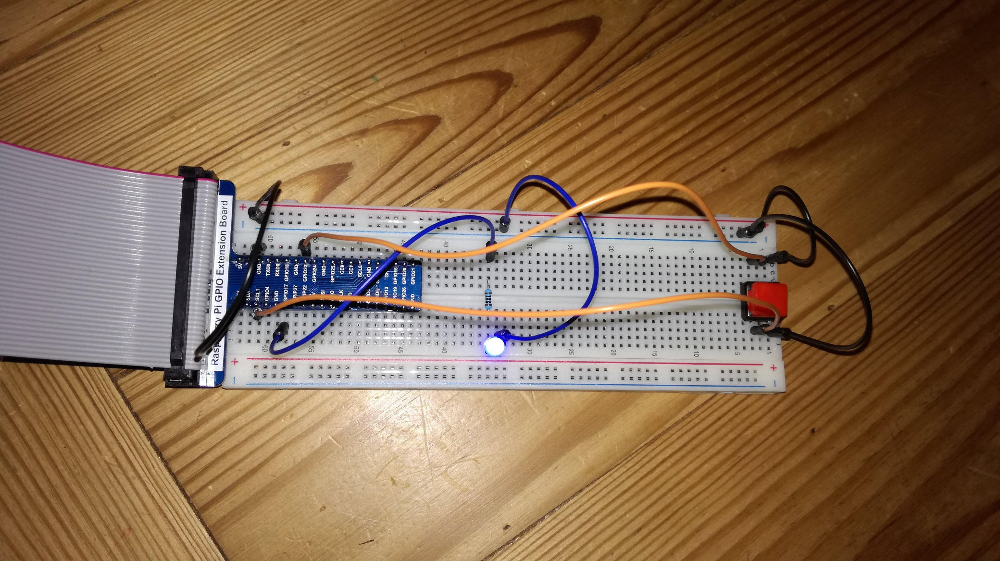

La fonction d'arrêt a pour source :
https://www.pihomeserver.fr/2013/10/25/raspberry-pi-home-server-ajouter-bouton-darret/

La fonction de démarrage vient de :
http://depcd.furtherassistance.com/rasplus/index.php/10-tutoriaux/45-bouton-mise-en-route-rpi

Cablage :
IMG_20180307_000400_r.jpg


Mise en place :
```shell
   cp etc/init.d/shutdown* /etc/init.d/
   chmod 755 /etc/init.d/shutdown.sh
   insserv shutdown.sh
```
